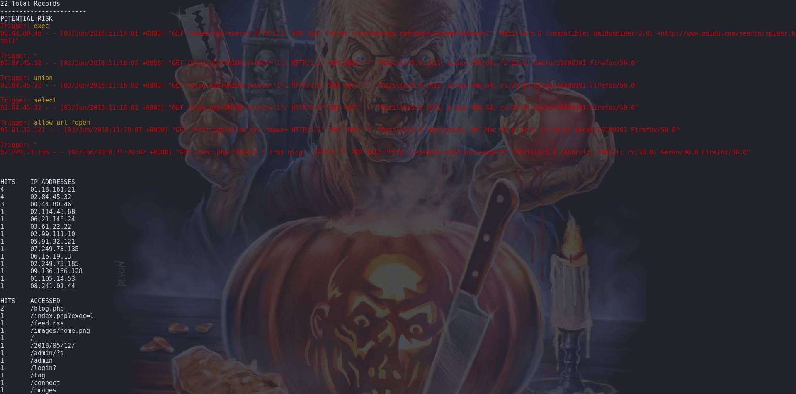

# Apache Access Log Viewer
Quick and simple PHP-based CLI application that generates human readable Apache access logs, sorted into data groupings:
 - Potentially Malicious
 - IP Addresses
 - Page/File Accessed
 - Protocol
 - HTTP Response (Success or Error)
 - Referrer
 - User Agent




### Requirements
 - Read permission to the directory where your log(s) reside
 - PHP-CLI (7.2+) *May work in older versions of PHP, but only tested in 7.2)*
 - Rotate your logs regularly, or this script will gobble your server's resources


 Install PHP-CLI on Debian/Ubuntu:
```bash
apt install php7.2-cli
```

CentOs/RHEL:
```bash
yum install php-cli
```

### To use
Clone the repo
```bash
git clone https://github.com/angela-d/php-logparse.git
```
After cloning the repo, you can test the script by going into the directory where logparse resides and running:
```bash
php logparse list
```
to out put a list of logs available.  Look for your access_log and make note of the numeric key beside it, and run:
```bash
php logparse 0
```
(replace 0 for the key of your access_log)

By default, the script is hardcoded to the test log.  To access your server's environment, modify **model/logparse.php** and specify the path to your log directory.

### Things to consider
- This is not a malware or exploit detection scanner.  Although there is detection for common script-kiddie exploits, it's by no means comprehensive.
- It was built with Apache's access log in mind.  If you wish to use it for other logs, you'll want to modify the regex of **view/logparse.php**
